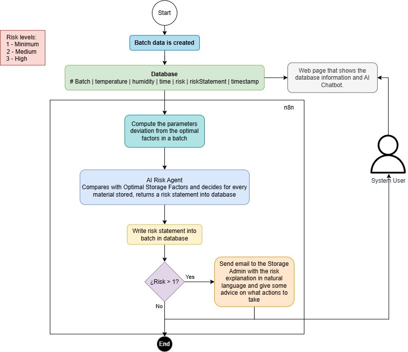

# Spoilage Quality Risk Alert System

---

## Overview

This system monitors raw material batches through automated workflows using n8n, Python, and AI agents (Groq/Google Gemini) to detect spoilage risks and alert administrators.

---

## System Diagram



---

## Architecture Components

| Component | Purpose | File Location |
|-----------|---------|-------------|
| Batch Simulator | Generates realistic batch datasets for testing | `simulators/batch_simulator.py` |
| Pre-Processor | Validates batch data against material limits | `processor/pre-processor.py` |
| AI Agent | Processes deviations and assigns risk categories | `agent/agent.py` |
| Alert Scheduler | Sends notifications via email/Slack | `alerts/alert_scheduler.py` |

---

## How to Run the Project

1. **Start the services** using Docker Compose:
   ```bash
   docker compose up -d
   ```

2. **Generate mock batch data**:
   ```bash
   python3.12 simulators/batch_simulator.py
   ```

3. **View the resulting data** in `data/generated_batches.json`

---

## Risk Categories

- **1 - Minimum**: Conditions within acceptable limits; continue normal storage and monitoring
- **2 - Medium**: Conditions approaching or moderately exceeding limits; batch inspection warranted (triggers **email alert**)
- **3 - High**: Significant deviations from storage conditions; high likelihood of spoilage (triggers **email alert**)

---

## Development

- See `processor/spec.md` for pre-processor documentation
- See `simulators/spec.md` for batch simulator documentation
- See `agent/spec.md` for AI agent prompt specification

---

*Made by Juan Camilo Cardenas Zabala. Document generated on 2026-07-23*